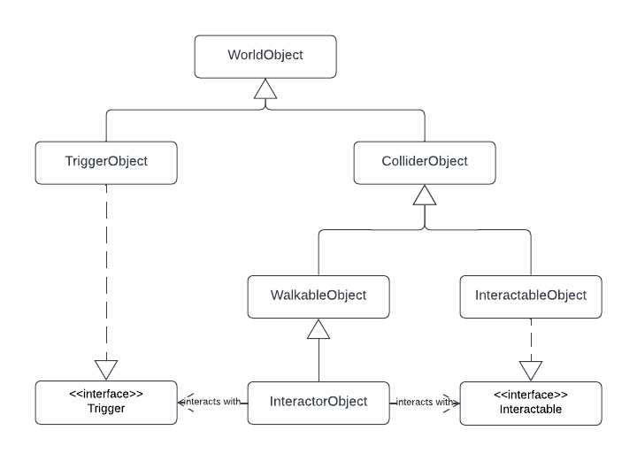

# World Objects

## Description

A `WorldObject` represents a game object that belongs to the `Grid` component and can be placed inside a specific cell.

This can include objects that can move, be interacted with or trigger something.

## Classes Diagram

There are some default classes that can help the user to achieve the desired behaviour, as listed bellow.

However, if none of the following scripts are enough to implement the needed functionalities, the **scalability** and **modularity** of the package, along with the smart **design patterns**, allow the user to easily extend any of the classes, expanding or changing the necessary behaviour.

### Collider Objects

Every world object that can potentially detect collisions must extend the `ColliderObject` class, which has a field to toggle collisions and utility methods to detect them.

### Interactable Objects

World objects that can be interacted with when an `InteractorObject` faces it or steps on it and intentionally activates it must extend the `InteractableObject` class.

This is an abstract class, so it is mandatory that a class implements its interaction behaviour.

Remember that an `InteractableObject` has to be intentionally interacted with, unlike a `TriggerObject`.

### Trigger Objects

`TriggerObject`s are similar to `InteractableObject`s, except that they are activated **"unintentionally"**, meaning that if a collision is detected between a `InteractorObject` and a `Trigger`, the interaction is automatically handled.

This is an abstract class, so it is mandatory that a class implements its interaction behaviour.

### Walkable Objects

Every world object that can potentially walk (and run must extend the `WalkableObject` class, which has fields to toggle walking and running and utility methods to move inside a specific `WalkableObject`.

### Interactor Objects

As described before, `InteractorObject`s are `WalkableObject`s that can interact with `Interactable`s and `Trigger`s.
